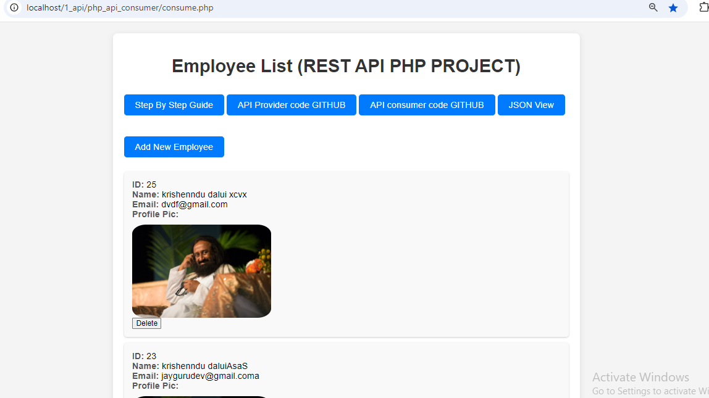
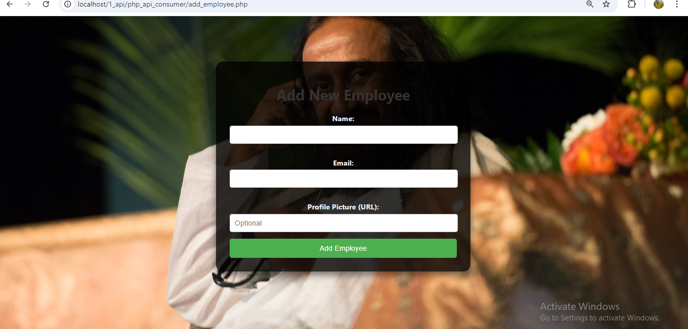
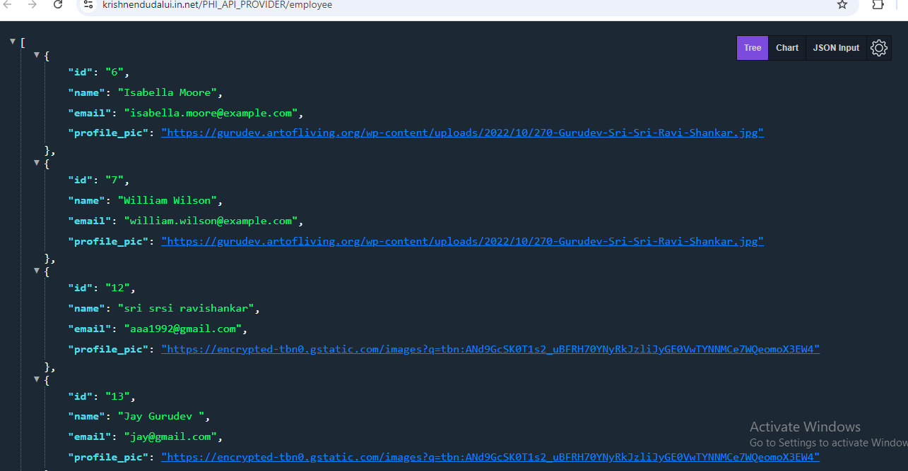
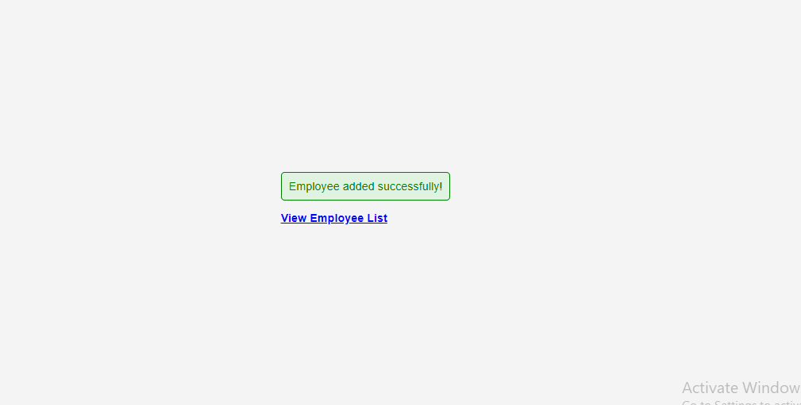

# PHP API Provider for Employee Management

This is a simple PHP RESTful API for managing employee data. The API allows you to perform CRUD (Create, Read, Update, Delete) operations on employee records.

## Project Name
**Employee Management API**

## Website
Step by step instruction guide : [https://docs.google.com/document/d/1icAqr_MDGY4GGNNXDLVuJJFNqQf8L-Ck/edit](https://docs.google.com/document/d/1icAqr_MDGY4GGNNXDLVuJJFNqQf8L-Ck/edit)

## Website
Watch Live Visit our website : [https://krishnendudalui.in.net/php-api-consumer/consume](https://krishnendudalui.in.net/php-api-consumer/consume)

## Table of Contents
- [Requirements](#requirements)
- [Installation](#installation)
- [API Endpoints](#api-endpoints)
  - [Get All Employees](#get-all-employees)
  - [Get Employee by ID](#get-employee-by-id)
  - [Add New Employee](#add-new-employee)
  - [Update Employee](#update-employee)
  - [Delete Employee](#delete-employee)
- [Database Setup](#database-setup)
- [Usage](#usage)
- [License](#license)

## Requirements
- PHP 7.0 or higher
- MySQL
- A web server (e.g., Apache, Nginx)

## Installation
1. Clone the repository:
   ```bash
   git clone <repository-url>
   cd php_api_provider
   

## image for Eployee View :


## image for Add Emplyee View :



## image for Add JSON View :


## image for Add Error View :
